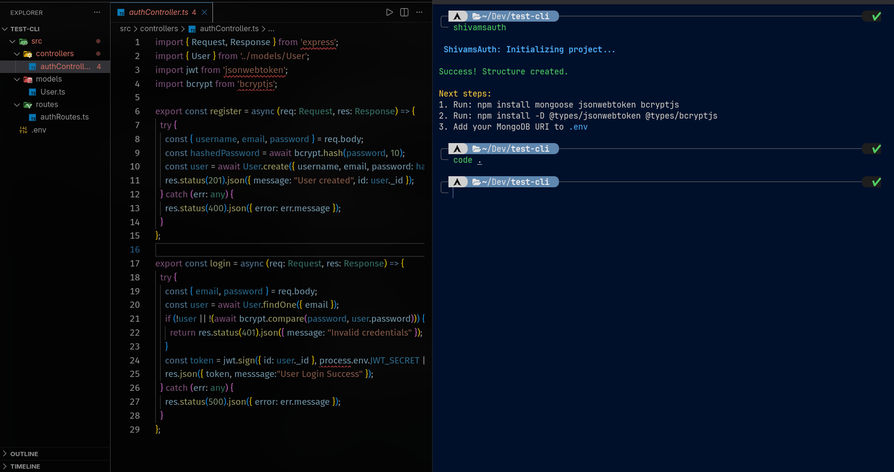
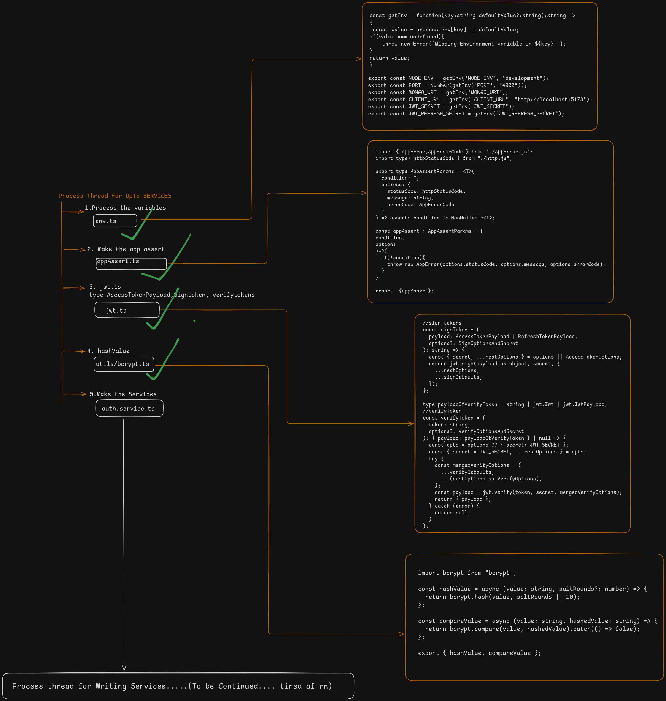

# shivamsauth-cli

 > **Linkedin:** https://www.linkedin.com/posts/shivamkarndev_dev-what-keynote-activity-7408146082595278848-ZPZC

A CLI tool to automate the setup of Express authentication with TypeScript, featuring a complete authentication system with sessions, JWT tokens, and robust error handling.

> **Project Status:** This is a "construction" phase prototype. It is currently being tested locally and is not yet published to npm.

## Architecture Overview

The authentication system follows a modular architecture with clear separation of concerns:

- **Models Layer**: User and Session models with Mongoose schemas
- **Utils Layer**: Reusable utilities for JWT, bcrypt, validation, and error handling
- **Controllers Layer**: Business logic for authentication operations
- **Routes Layer**: Express route definitions
- **Validation Layer**: Zod schemas for request validation

## What it builds

Running this tool generates a complete authentication system with:

### Models
- **User Model**: Mongoose schema with TypeScript interfaces
  - Fields: username, email, password, timestamps
  - Methods: `comparePassword()`, `omitPassword()`
  - Pre-save hook for password hashing
- **Session Model**: Session management with expiration tracking
  - Fields: userId, userAgent, createdAt, expiresAt
  - Automatic 30-day expiration

### Utils
- **JWT Utilities**: Token signing and verification
  - Access tokens (1 day expiration)
  - Refresh tokens (30 day expiration)
  - Type-safe payload interfaces
- **Bcrypt Utilities**: Password hashing and comparison
- **Error Handling**: Custom AppError class with error codes
- **Assert Helper**: Type-safe assertion utility
- **HTTP Status Codes**: Centralized status code constants
- **Date Utilities**: Helper functions for date calculations
- **Environment Variables**: Type-safe env variable access

### Controllers
- Authentication logic for login and registration
- Session management
- Token refresh functionality

### Routes
- Express routes for authentication endpoints
- Ready-to-integrate with existing Express apps

### Validation
- Zod schemas for request validation
- Type-safe input validation

## Tech Stack

- **Node.js** (npm)
- **TypeScript** (NodeNext ESM configuration)
- **Express** (v5.2.1)
- **Mongoose** (v9.0.2) - MongoDB ODM
- **jsonwebtoken** (v9.0.3) - JWT token handling
- **bcrypt** (v6.0.0) - Password hashing
- **Zod** (v4.2.1) - Schema validation
- **Chalk** (v5.3.0) - Terminal styling
- **fs-extra** (v11.2.0) - File system management

## Features

### Security
- Bcrypt password hashing with salt rounds
- JWT-based authentication (Access + Refresh tokens)
- Session tracking with user agent
- Custom error handling with specific error codes

### Type Safety
- Full TypeScript support with strict typing
- Type-safe JWT payloads
- Interface-driven development
- Mongoose document typing

### Developer Experience
- Modular architecture
- Reusable utility functions
- Clear separation of concerns
- ESM module support

## Future Roadmap

- [ ] Add auto-installation of dependencies
- [ ] Add support for different folder structures
- [ ] Add custom schema fields via terminal prompts
- [ ] Add email verification flow
- [ ] Add password reset functionality
- [ ] Add OAuth integration options
- [ ] Add rate limiting utilities
- [ ] Official npm release

## Disclaimer

This project is currently in active development. The core authentication system is implemented and being refined. Use it for learning and exploration while the real construction is underway.
