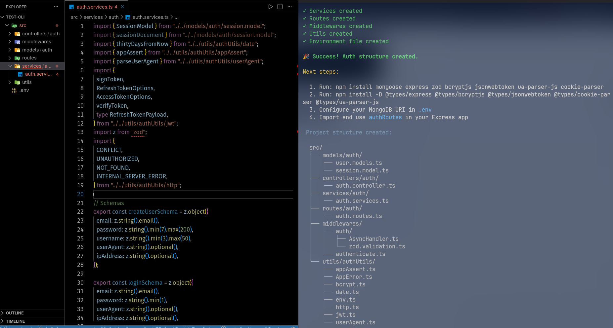
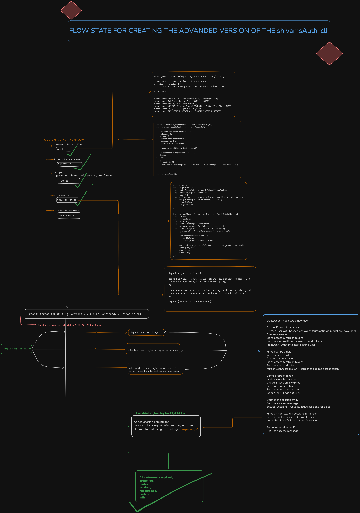

# shivamsauth-cli



> **Linkedin:** https://www.linkedin.com/posts/shivamkarndev_christmasgift-december25th-countdown-activity-7409267844993118208-nMzk

A complete authentication system for Express applications with TypeScript, featuring JWT-based authentication, session management, refresh token rotation, and comprehensive security features.

> **Project Status:** Core authentication system is fully implemented with services, controllers, routes, and middleware. Currently being tested locally before npm release.

## Architecture Overview



The authentication system follows a clean, modular architecture with complete separation of concerns:

- **Models Layer**: User and Session models with Mongoose schemas and TypeScript interfaces
- **Services Layer**: Business logic for authentication operations (register, login, refresh, sessions)
- **Controllers Layer**: Request/response handling and cookie management
- **Routes Layer**: Express route definitions with validation middleware
- **Middleware Layer**: JWT authentication and request validation
- **Utils Layer**: Reusable utilities for JWT, bcrypt, validation, and error handling

## What it builds

Running this tool generates a production-ready authentication system with:

### Models

- **User Model**: Mongoose schema with TypeScript interfaces
  - Fields: username, email, password, timestamps
  - Methods: `comparePassword()`, `omitPassword()`
  - Pre-save hook for automatic password hashing
  - Full TypeScript type safety with `IUser` interface
- **Session Model**: Multi-device session management with expiration tracking
  - Fields: userId (ref to User), userAgent, createdAt, expiresAt
  - Automatic 30-day expiration with `thirtyDaysFromNow()` utility
  - Proper ObjectId typing with `Types.ObjectId`

### Services (`auth.services.ts`)

Complete authentication business logic:

- **`createUser`**: User registration with duplicate checking

  - Validates unique email
  - Creates user with hashed password
  - Creates initial session
  - Returns user data and tokens

- **`loginUser`**: User authentication

  - Email and password verification
  - Session creation with user agent tracking
  - JWT token generation

- **`refreshUserAccessToken`**: Token refresh with rotation

  - Verifies refresh token
  - Validates session existence and expiration
  - **Rotates refresh token** (security best practice)
  - Extends session expiry by 30 days
  - Saves updated session to database

- **`logoutUser`**: Session termination

  - Deletes specific session from database
  - Supports multi-device logout

- **`getUserSessions`**: Session management

  - Lists all active sessions for a user
  - Sorted by creation date

- **`deleteSession`**: Remove specific session
  - Allows users to logout from specific devices

### Controllers (`auth.controller.ts`)

Request handlers with HTTP response formatting:

- **`registerController`**: Handle user registration

  - Validates input with Zod schemas
  - Sets httpOnly cookie for refresh token
  - Returns user data and access token

- **`loginController`**: Handle user login

  - Validates credentials
  - Manages cookie-based refresh token
  - Returns authentication response

- **`refreshTokenController`**: Handle token refresh

  - Extracts refresh token from httpOnly cookie
  - Returns new access token and rotated refresh token
  - Updates refresh token cookie

- **`logoutController`**: Handle user logout

  - Requires authentication
  - Clears refresh token cookie
  - Deletes session from database

- **`getSessionsController`**: List user sessions

  - Protected route
  - Returns all active sessions

- **`deleteSessionController`**: Remove specific session
  - Protected route
  - Allows selective device logout

### Routes (`user.routes.ts`)

Express router with integrated validation:

**Public Routes:**

- `POST /auth/register` - User registration with validation
- `POST /auth/login` - User authentication
- `POST /auth/refresh` - Access token refresh

**Protected Routes (require Bearer token):**

- `POST /auth/logout` - Logout current session
- `GET /auth/sessions` - Get all user sessions
- `DELETE /auth/sessions/:sessionId` - Delete specific session

### Middleware

- **`authenticate`**: JWT verification middleware
  - Extracts Bearer token from Authorization header
  - Verifies access token signature
  - Attaches userId and sessionId to request object
  - Type-safe with Express Request extension
- **`validateBody`**: Zod schema validation
  - Validates request body against Zod schemas
  - Returns formatted validation errors
  - Prevents invalid data from reaching controllers

### Utils

- **JWT Utilities** (`jwt.ts`): Comprehensive token management
  - `signToken()`: Create signed JWT tokens
  - `verifyToken()`: Verify and decode tokens
  - Access tokens (1 day expiration)
  - Refresh tokens (30 day expiration)
  - Type-safe payload interfaces (`AccessTokenPayload`, `RefreshTokenPayload`)
  - Separate secret keys for access and refresh tokens
- **Bcrypt Utilities** (`bcrypt.ts`): Password security
  - `hashValue()`: Hash passwords with configurable salt rounds
  - `compareValue()`: Verify passwords against hashes
- **Error Handling** (`AppError.ts`, `appAssert.ts`):
  - Custom `AppError` class with status codes and error codes
  - Type-safe `appAssert()` function with assertion typing
  - Centralized error management
- **HTTP Status Codes** (`http.ts`): Type-safe constants
  - 200 OK, 201 CREATED, 400 BAD_REQUEST, 401 UNAUTHORIZED
  - 403 FORBIDDEN, 404 NOT_FOUND, 409 CONFLICT, 422 UNPROCESSABLE_CONTENT
  - 429 TOO_MANY_REQUESTS, 500 INTERNAL_SERVER_ERROR
- **Date Utilities** (`date.ts`): Helper functions
  - `thirtyDaysFromNow()`: Calculate session expiration
- **Environment Variables** (`env.ts`): Type-safe env access
  - JWT_SECRET, JWT_REFRESH_SECRET
  - Centralized configuration

### Validation (`zod.validation.ts`)

- Zod schema-based request validation
- `validateBody()`: Middleware for body validation
- `validateRequest()`: Comprehensive request validation (body, query, params)
- Formatted error responses with field-level details

## Tech Stack

- **Node.js** (npm)
- **TypeScript** (NodeNext ESM configuration with strict typing)
- **Express** (v5.2.1) - Web framework
- **Mongoose** (v9.0.2) - MongoDB ODM
- **jsonwebtoken** (v9.0.3) - JWT token handling
- **bcrypt** (v6.0.0) - Password hashing
- **Zod** (v4.2.1) - Schema validation
- **cookie-parser** - Cookie management
- **Chalk** (v5.3.0) - Terminal styling
- **fs-extra** (v11.2.0) - File system management

## Features

### Security

**Password Security**

- Bcrypt password hashing with salt rounds
- Pre-save hooks for automatic hashing
- Secure password comparison

  **Token-Based Authentication**

- JWT access tokens (short-lived: 1 day)
- JWT refresh tokens (long-lived: 30 days)
- **Refresh token rotation** on every refresh request
- Separate secret keys for access and refresh tokens
- httpOnly cookies for refresh tokens (XSS protection)

**Session Management**

- Multi-device session tracking
- Session expiration management
- Session extension on token refresh
- User agent tracking
- Ability to logout from all devices or specific devices

  **Error Handling**

- Custom error classes with status codes
- Type-safe assertion utilities
- Centralized error responses
- Validation error formatting

### Type Safety

Full TypeScript support with strict typing
Type-safe JWT payloads
Mongoose document interfaces
Express Request type extensions
No `any` types - proper TypeScript throughout
Type-safe environment variables

### Developer Experience

Modular, maintainable architecture
Clear separation of concerns (Services → Controllers → Routes)
Reusable utility functions
AsyncHandler for clean error handling
ESM module support
Comprehensive JSDoc comments
Example app setup included

### API Features

- RESTful API design
- Input validation with Zod schemas
- Protected and public routes
- Cookie-based refresh token storage
- Bearer token authentication
- Session listing and management
- Selective device logout

## Quick Start

### Installation

```bash
npm install shivamsauth
# or
npx shivamsauth init
```

### Usage

```typescript
import express from "express";
import cookieParser from "cookie-parser";
import authRoutes from "./Blueprints/user.routes.js";

const app = express();

app.use(express.json());
app.use(cookieParser());
app.use("/auth", authRoutes);

app.listen(3000);
```

### API Endpoints

**Register User**

```bash
POST /auth/register
Body: { email, password, username }
Response: { user, accessToken } + httpOnly cookie
```

**Login**

```bash
POST /auth/login
Body: { email, password }
Response: { user, accessToken } + httpOnly cookie
```

**Refresh Token**

```bash
POST /auth/refresh
Cookie: refreshToken (httpOnly)
Response: { accessToken } + new httpOnly cookie (rotated)
```

**Logout**

```bash
POST /auth/logout
Headers: Authorization: Bearer <accessToken>
Response: { message }
```

**Get Sessions**

```bash
GET /auth/sessions
Headers: Authorization: Bearer <accessToken>
Response: { sessions: [...] }
```

**Delete Session**

```bash
DELETE /auth/sessions/:sessionId
Headers: Authorization: Bearer <accessToken>
Response: { message }
```

## Project Structure

```
src/
├── Blueprints/
│   ├── user.models.ts          # User Mongoose model
│   ├── session.model.ts        # Session Mongoose model
│   ├── auth.services.ts        # Authentication business logic
│   ├── auth.controller.ts      # Request/response handlers
│   ├── user.routes.ts          # Express routes
│   ├── zod.validation.ts       # Validation middleware
│   └── AsyncHandler.ts         # Async error wrapper
├── middleware/
│   └── authenticate.ts         # JWT authentication middleware
├── utils/
│   ├── jwt.ts                  # JWT utilities
│   ├── bcrypt.ts               # Password hashing
│   ├── appAssert.ts            # Type-safe assertions
│   ├── AppError.ts             # Custom error class
│   ├── http.ts                 # HTTP status codes
│   ├── date.ts                 # Date utilities
│   └── env.ts                  # Environment config
└── app.example.ts              # Example Express setup
```

## Future Roadmap

- [x] Complete authentication services layer
- [x] Implement controllers with cookie management
- [x] Create routes with validation
- [x] Add authentication middleware
- [x] Refresh token rotation
- [x] Session management (multi-device support)
- [ ] Add auto-installation of dependencies
- [ ] CLI commands for initialization
- [ ] Add support for different folder structures
- [ ] Add email verification flow
- [ ] Add password reset functionality
- [ ] Add OAuth integration options
- [ ] Add rate limiting utilities
- [ ] Add two-factor authentication (2FA)
- [ ] Official npm release

## Development Status

**Completed:**

- User and Session models with TypeScript interfaces
- Complete authentication services (register, login, refresh, logout)
- Refresh token rotation with session extension
- Controllers with httpOnly cookie management
- Express routes with validation middleware
- JWT authentication middleware
- Zod schema validation
- Error handling utilities
- Type-safe throughout (no `any` types)

**In Progress:**

- Local testing and refinement
- CLI tool for easy project setup
- Documentation and examples

## Contributing

This project is in active development. Contributions, issues, and feature requests are welcome!

## License

MIT

## Disclaimer

This project is production-ready for authentication logic but is still being packaged as a CLI tool. The core authentication system is fully implemented and tested. Use it for learning and real projects while the CLI distribution is being finalized.
